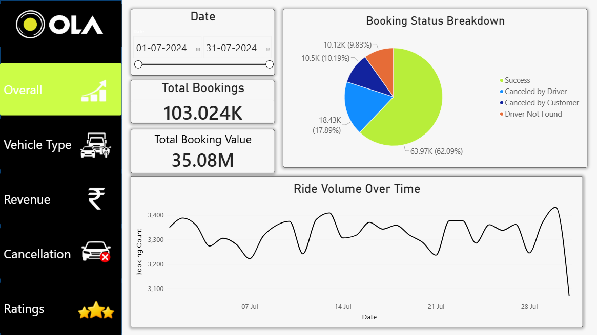
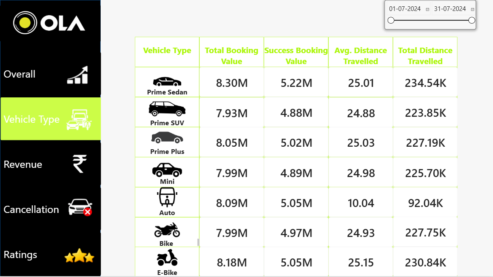
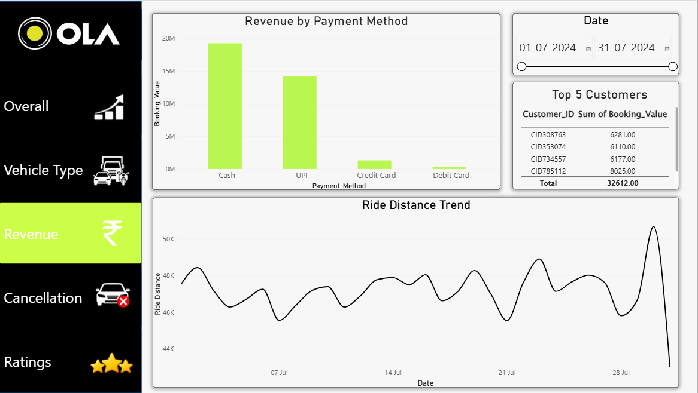
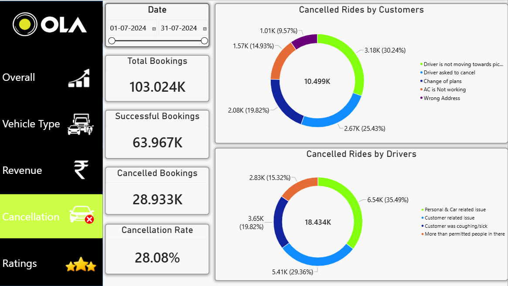
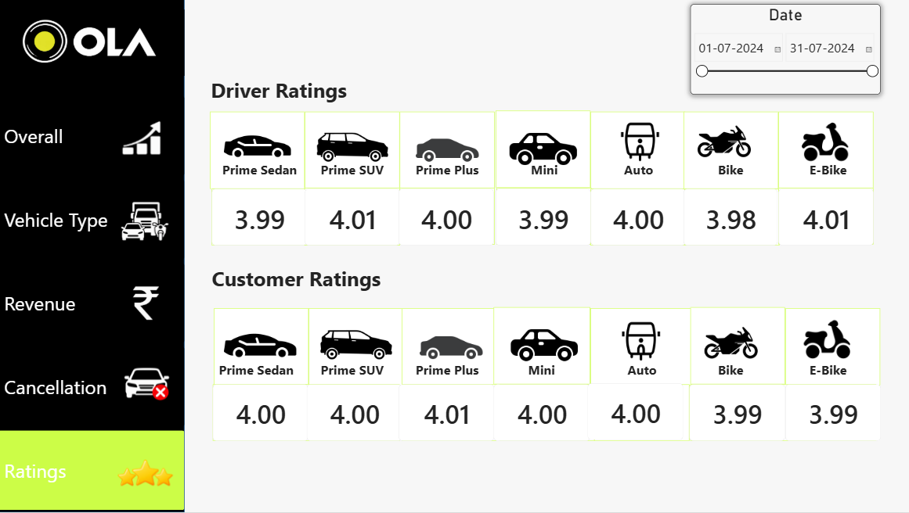

# Ola-Ride-Analytics

Ola ride booking data analysis using Power BI and SQL.

## Project Overview

This project analyzes Ola ride booking data to understand ride performance, revenue, cancellations, vehicle-wise performance, and customer and driver ratings.

The project uses **SQL** for data analysis and **Power BI** to create an interactive five-page dashboard.

## Tools & Technologies

- Power BI
- SQL
- MySQL
- DAX
- Data Visualization
- Data Analysis

## Power BI Dashboard

The dashboard contains five pages:

### 1. Overall Dashboard

Provides an overall view of ride booking performance, including total bookings, successful bookings, cancelled bookings, revenue, booking status, and ride volume over time.

### 2. Vehicle Type

Analyzes booking value and ride distance across different vehicle types.

### 3. Revenue

Provides insights into revenue by payment method, top customers, and ride distance trends.

### 4. Cancellation

Analyzes cancelled rides by customers and drivers, along with the cancellation rate.

### 5. Ratings

Displays average driver and customer ratings across different vehicle types.

## SQL Analysis

SQL queries were used to analyze the ride booking data and extract meaningful insights.

The SQL queries are available in:

**`Ola_Ride_Analysis.sql`**

## Project Files

- `OlaProject.pbix` — Power BI dashboard
- `Ola_Ride_Analysis.sql` — SQL analysis queries
- `Overall.png` — Overall dashboard
- `Vehicle_Type.png` — Vehicle Type dashboard
- `Revenue.png` — Revenue dashboard
- `Cancellation.png` — Cancellation dashboard
- `Ratings.png` — Ratings dashboard

## Key Areas Analyzed

- Ride booking performance
- Successful and cancelled rides
- Revenue and booking value
- Payment methods
- Vehicle type performance
- Ride distance
- Customer and driver cancellations
- Customer ratings
- Driver ratings

## Key Insights

- The dataset contains approximately **103K ride bookings**.
- Approximately **64K rides were successfully completed**, while the overall cancellation rate was **28.08%**.
- The dashboard shows differences in **booking value and ride distance across vehicle types**.
- **Payment methods** contribute differently to overall booking value.
- Ride volume and ride distance show **variation over time**.
- Customer and driver cancellation patterns can be compared separately.
- Customer and driver ratings vary across different vehicle types.

## Conclusion

The project combines SQL-based data analysis with Power BI visualization to provide a comprehensive view of Ola ride booking performance and customer experience.
